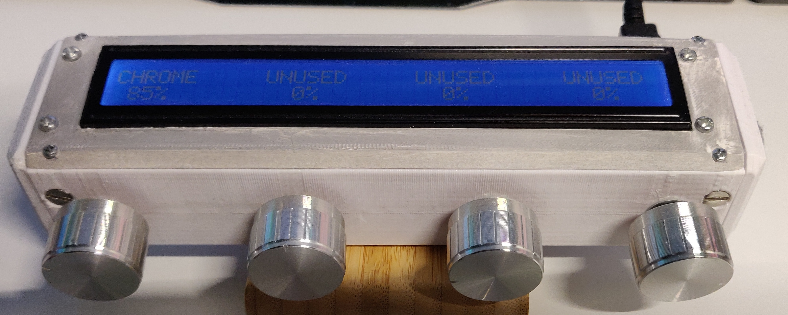
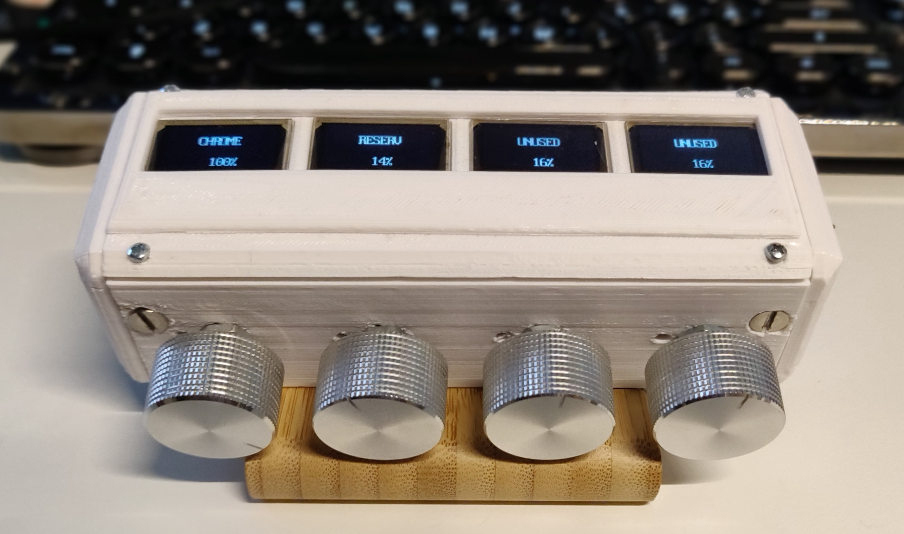
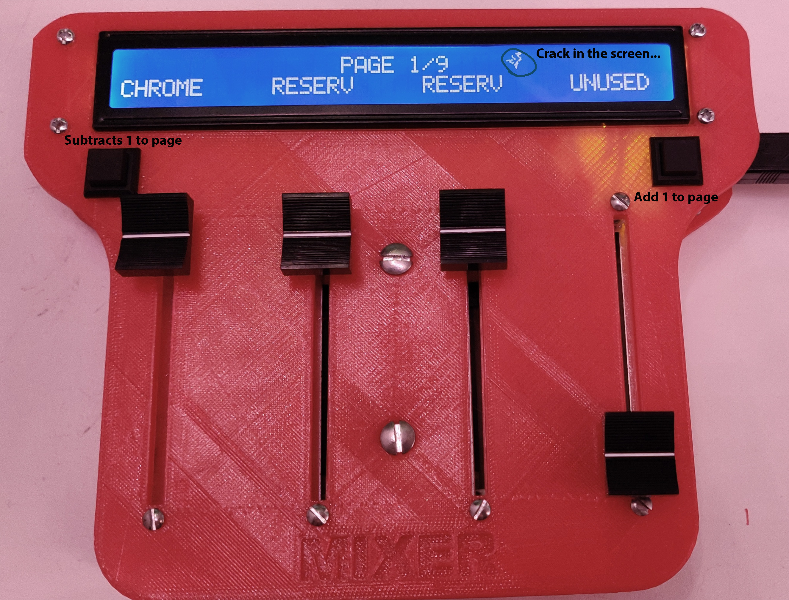

# ArduinoMixer
This is the driver software for an external device. See pictures below!

# Features
### Reservation:
You can reserv specific spots on the device.
That spot will always be allocated for the specific program.
For example: if you reserv spot 1 for Chrome, that spot cannot be anything else than Chrome. 
If Chrome is not open it will be called "RESERV"

### Exclusion:
You can exclude programs.
For example: if you exclude the "system" audio session, it will not show up on the screen.
This always take priority over reservation!

### Rename:
Since ArduinoMixer gets the process name of all sessions it might be a weird name.
For example: windows music "Groove" process name is "MUSIC.UI", then you can rename it to "GROOVE". 

# VERSION 4
### New Features
Version 4 has some new hardware features. The volume wheels are now rotary encoders, instead of potentiometer. Which means better customisation and accuracy.

 
 

# VERSION 3

 
 

# VERSION 2

 
 

